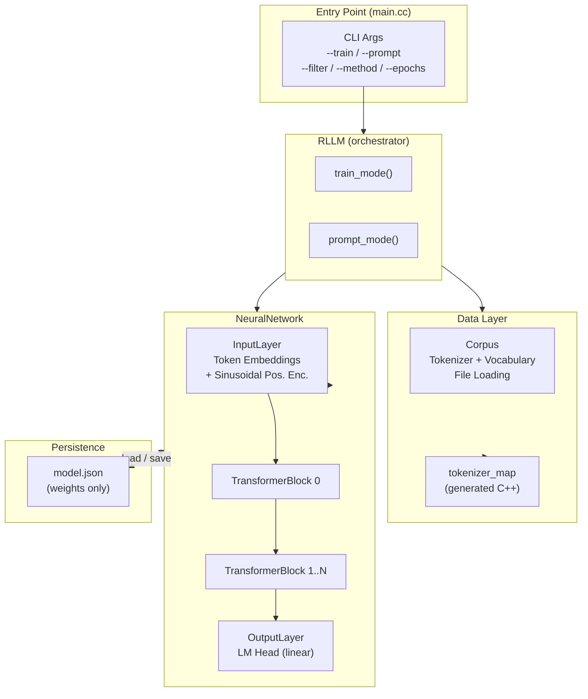
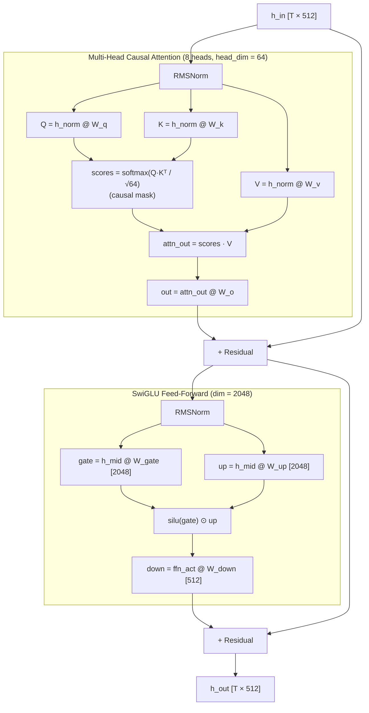
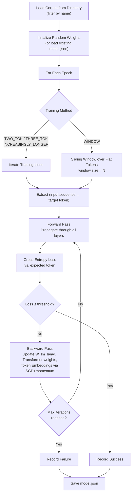
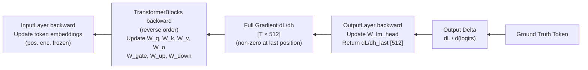
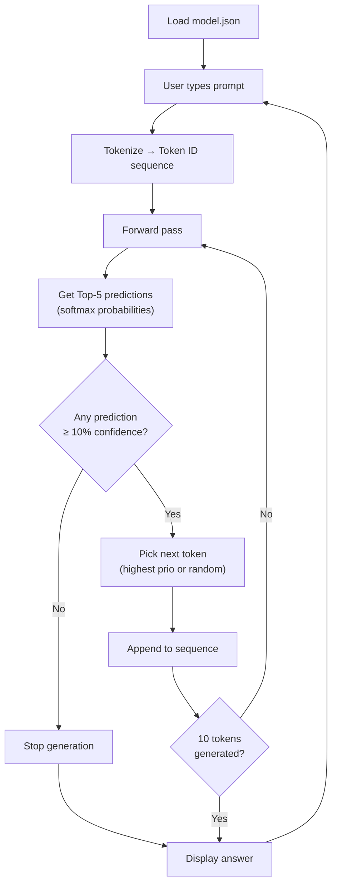

# RLLM Architecture

RLLM is a small-scale experimental language model for next-token prediction. It implements a transformer decoder stack with multi-head causal self-attention, SwiGLU feed-forward blocks, and sinusoidal positional encodings, trained with SGD + momentum.

---

## System Overview



---

## Forward Pass (Inference)

```mermaid
graph LR
    Tokens["Input Token IDs\n[t₀, t₁, ..., tₙ]"]
    Embed["Token Embedding Lookup\nE[T × 512]"]
    PosEnc["+ Sinusoidal\nPositional Encoding"]
    H["Hidden State h\n[T × 512]"]
    Blocks["Transformer Blocks × N\n(stacked)"]
    HLast["h_last[512]\n(final position)"]
    LMHead["LM Head\nW_lm_head @ h_last\nLogits[vocab]"]
    Softmax["Softmax\nProbabilities[vocab]"]
    TopK["Top-K OutputTokens\n{token_id, probability}"]

    Tokens --> Embed --> PosEnc --> H --> Blocks --> HLast --> LMHead --> Softmax --> TopK
```



---

## Transformer Block (single)



---

## Training Flow



**Training methods:**

| Method | Input | Target |
|--------|-------|--------|
| `TWO_TOK` | `[t₀]` | `t₁` |
| `THREE_TOK` | `[t₀, t₁]` | `t₂` |
| `INCREASINGLY_LONGER_SEQUENCES` | `[t₀ … tₖ]`, k = 1 → line_len−1 | `tₖ₊₁` |
| `WINDOW:N` | `[tᵢ … tᵢ₊ₙ₋₁]` (sliding) | `tᵢ₊ₙ` |

---

## Backward Pass



**Optimizer:** SGD + momentum (β = 0.9), lr = 0.01, gradient clip ±1.0, weight clamp ±2.0.

---

## Prompt Mode (Inference Loop)



---

## Key Compile-Time Dimensions

| Enum | Value | Meaning |
|------|-------|---------|
| `EmbeddingDimension::MAX` | 512 | Hidden state / model dimension |
| `PositionIndex::MAX` | 128 | Max sequence length |
| `HeadsIndex::MAX` | 8 | Number of attention heads |
| `HeadDimension::MAX` | 64 | Per-head dim (512 / 8) |
| `FFDimension::MAX` | 2048 | FFN intermediate dim (512 × 4) |

---

## File Map

```
include/
  RLLM.hpp              – Top-level orchestrator interface
  NeuralNetwork.hpp     – Core model: forward / backward / serialization
  InputLayer.hpp        – Token embeddings + positional encoding
  TransformerBlock.hpp  – Single decoder block (attention + FFN)
  OutputLayer.hpp       – LM head (linear projection to vocab logits)
  Corpus.hpp            – Tokenizer, vocabulary, training data iteration
  LayerPrimitives.hpp   – Shared enums, matrix types, Score, OutputToken

src/
  main.cc               – CLI argument parsing, entry point
  RLLM.cc               – train_mode() and prompt_mode() implementations
  NeuralNetwork.cc      – Forward pass, backward pass, serialization
  TransformerBlock.cc   – Attention + SwiGLU forward & backward
  InputLayer.cc         – Embedding lookup + sinusoidal enc.
  OutputLayer.cc        – LM head forward, loss, backward
  Corpus.cpp            – File loading, tokenization, line iteration
  serialization.cc      – JSON load/save helpers

build/generated/
  tokenizer_map.cc/.hpp – Auto-generated token↔ID mapping (from create_tokenizer_map.py)
```
